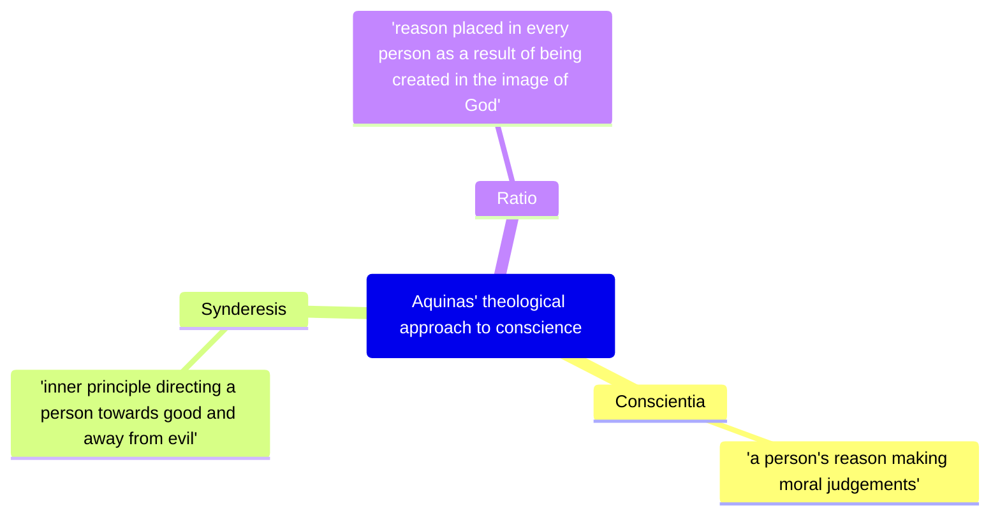
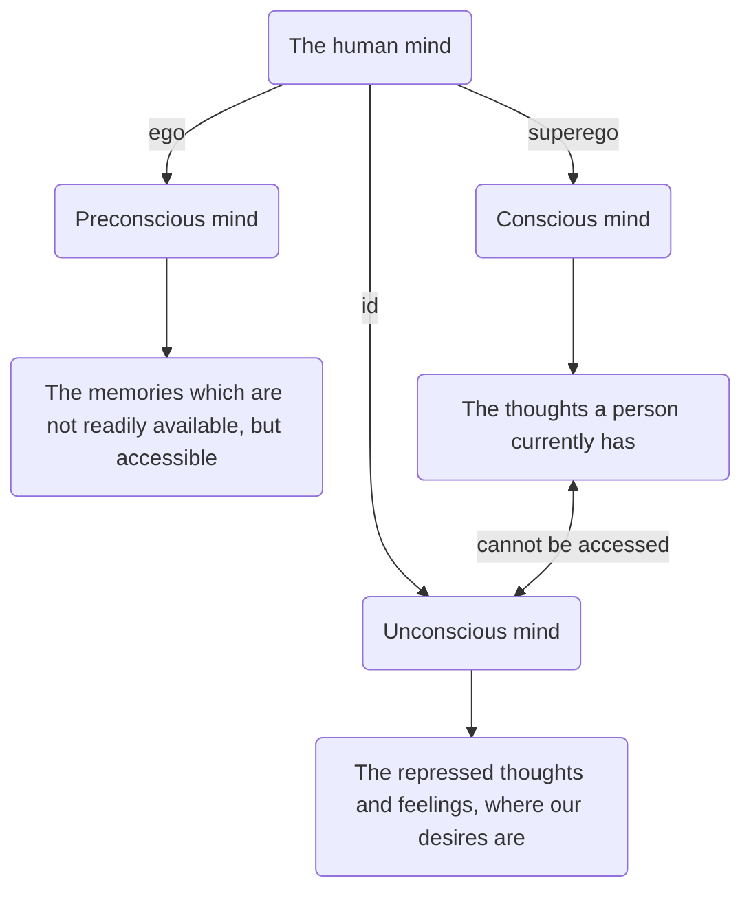

---
{"dg-publish":true,"permalink":"/01-philosophy/02-ethics/aquinas-and-freud-conscience/","tags":["lessonmajor"],"noteIcon":"","updated":"2026-02-25T09:10:49.130+00:00"}
---

**Table of Contents**

- [[01 - Philosophy/02 Ethics/Aquinas and Freud conscience#Aquinas\|Aquinas]]
	- [[01 - Philosophy/02 Ethics/Aquinas and Freud conscience#Aquinas\|Terminology]]
	- [[01 - Philosophy/02 Ethics/Aquinas and Freud conscience#Aquinas\|His beliefs]]
		- [[01 - Philosophy/02 Ethics/Aquinas and Freud conscience#His beliefs\|Ignorance]]
			- [[01 - Philosophy/02 Ethics/Aquinas and Freud conscience#Ignorance\|Types of ignorance]]
- [[01 - Philosophy/02 Ethics/Aquinas and Freud conscience#Other Philosophers\|Other Philosophers]]
	- [[01 - Philosophy/02 Ethics/Aquinas and Freud conscience#Other Philosophers\|Joseph Butler (1692-1752)]]
		- [[01 - Philosophy/02 Ethics/Aquinas and Freud conscience#Joseph Butler (1692-1752)\|Conscience from God]]
		- [[01 - Philosophy/02 Ethics/Aquinas and Freud conscience#Joseph Butler (1692-1752)\|Authority]]
		- [[01 - Philosophy/02 Ethics/Aquinas and Freud conscience#Joseph Butler (1692-1752)\|Hierarchy of human nature]]
	- [[01 - Philosophy/02 Ethics/Aquinas and Freud conscience#Other Philosophers\|John Henry Newman (1801-1890)]]
		- [[01 - Philosophy/02 Ethics/Aquinas and Freud conscience#John Henry Newman (1801-1890)\|The voice of God]]
		- [[01 - Philosophy/02 Ethics/Aquinas and Freud conscience#John Henry Newman (1801-1890)\|Conscience and intuition]]
- [[01 - Philosophy/02 Ethics/Aquinas and Freud conscience#Sigmund Freud\|Sigmund Freud]]
	- [[01 - Philosophy/02 Ethics/Aquinas and Freud conscience#Sigmund Freud\|Terminology]]
	- [[01 - Philosophy/02 Ethics/Aquinas and Freud conscience#Sigmund Freud\|His beliefs]]
		- [[01 - Philosophy/02 Ethics/Aquinas and Freud conscience#His beliefs\|The human mind]]
			- [[01 - Philosophy/02 Ethics/Aquinas and Freud conscience#The human mind\|The Id]]
			- [[01 - Philosophy/02 Ethics/Aquinas and Freud conscience#The human mind\|The ego]]
			- [[01 - Philosophy/02 Ethics/Aquinas and Freud conscience#The human mind\|The super-ego]]
	- [[01 - Philosophy/02 Ethics/Aquinas and Freud conscience#Sigmund Freud\|Other philosophers]]
		- [[01 - Philosophy/02 Ethics/Aquinas and Freud conscience#Other philosophers\|Jean Piaget (1896-1980)]]
			- [[01 - Philosophy/02 Ethics/Aquinas and Freud conscience#Jean Piaget (1896-1980)\|Development of the conscience]]
			- [[01 - Philosophy/02 Ethics/Aquinas and Freud conscience#Jean Piaget (1896-1980)\|Stages of moral development]]
		- [[01 - Philosophy/02 Ethics/Aquinas and Freud conscience#Other philosophers\|Erich Fromm (1900-1980)]]
			- [[01 - Philosophy/02 Ethics/Aquinas and Freud conscience#Erich Fromm (1900-1980)\|Authoritarian Conscience]]
- [[01 - Philosophy/02 Ethics/Aquinas and Freud conscience#Direct comparison\|Direct comparison]]
		- [[01 - Philosophy/02 Ethics/Aquinas and Freud conscience#Other philosophers\|Crime and punishment — Raskolknov]]

## Aquinas 
### Terminology
> [!note] I recommend trying to answer these questions without scrolling down to see the answers.

1. What is conscience?
2. What is ratio?
3. What is synderesis?
4. What is conscientia?
5. What is vincible ignorance?
6. What is invincible ignorance?

### His beliefs

#### Ignorance
- Aquinas acknowledged that people do and will make mistakes. Some people may make mistakes intentionally, but Aquinas also accepted that these can be accidental
	- such as making a mistake on the path from synderesis to conscientia
	- or incorrect use of synderesis
- with the second, Aquinas argues that even if people do the wrong thing, they are still following their conscience. Their conscience is wrong, yes, but they are still following what it tells them.
- Aquinas uses this to explain why people to bad things; many of them appear to be following their conscience, but their conscience has made a mistake.
	- or, that person may be deliberately ignoring their conscience, which goes against the Divine Law & is ignoring God. Obviously, he isn't too happy about that.
- However, although we make mistakes from time to time, Aquinas still maintains that *"It is always right to follow your conscience."*
- This is because conscience is the best thing that we have when it comes to making moral decisions
	- it isn't flawless, but it is far superior to anything else we could use, so we should always use it despite the risk of something going wrong. 
	- plus, it's God-Given, so Aquinas would argue that you have to follow it.

##### Types of ignorance

| Vincible ignorance                                                                                                                                                                                                           | Invincible ignorance                                                                                                                                                                                                                                                                                                                                                     |
| ---------------------------------------------------------------------------------------------------------------------------------------------------------------------------------------------------------------------------- | ------------------------------------------------------------------------------------------------------------------------------------------------------------------------------------------------------------------------------------------------------------------------------------------------------------------------------------------------------------------------ |
| lack of knowledge for which a person is responsible                                                                                                                                                                          | lack of knowledge for which a person is not responsible                                                                                                                                                                                                                                                                                                                  |
| You ought to have known better. Vincible ignorance is not an excuse and the person who demonstrates it is morally culpable for the acts carried out as a result. They cannot claim that 'conscience' justifies their actions | when a person acts to the best of their knowledge, having done all they can to reasonably inform themselves, but nevertheless get it wrong and act immorally. Aquinas does not believe that God will condemn humans for invincible ignorance. If they fear God and live according to their conscience, God will give them salvation even though they acted immorally. |
## Other Philosophers
### Joseph Butler (1692-1752)

#### Conscience from God
> [!quote] "There is a principle reflection in men by which they distinguish between approval and disapproval of their own actions... this principle in man... is conscience."

- This is what distinguishes us from animals — we are in touch with God's will.

#### Authority
- the conscience *'magisterially exerts itself'* spontaneously *'without being consulted'* automatically and with authority
- *'Had it strength, as it has right; had it power as it has manifest authority: it would absolutely govern the world.'*
#### Hierarchy of human nature
1. conscience
2. principles of reflection
	-  approve or disapprove of our actions
3. impulse of self-love and benevolence
	- selfishness and selflessness
4. drives
	- no thought of consequence

### John Henry Newman (1801-1890)

#### The voice of God
- when a person follows conscience he is simultaneously and mysteriously following a divine law
	- letter to the Duke of Norfolk (1874)

#### Conscience and intuition
- conscience is a 'messenger' of God speaking to us
- when we make moral decisions or feel intuition, that is God's voice
- at it's best, conscience detects truth

> [!quote] 'If, as is the case, we feel responsibility, are ashamed, are frightened, at transgressing the voice of conscience, this implies there is One to whom we are responsible, before whom we are ashamed, whose claims upon us we fear' — The Grammar of Assent

## Sigmund Freud
### Terminology
1. What is the Id?
2. What is the Ego?
3. What is the Super-Ego?

### His beliefs
- Believed that the conscience is psychologically created in order to stop ourselves from carrying out our basic desires which may be socially unacceptable. 
- if we disobey our conscience, we feel guilty.

#### The human mind
Freud argued that the human mind is made up of three parts:

##### The Id
> Instinctive impulses that see satisfaction in pleasure

- the Id is an entirely unconscious aspect of personality that is present from birth
- it is the central component of personality and is powerful, instinctive & primitive
- it is the place in our minds that deals with passions and desires
- it is driven by immediate gratification
- Freud said that the libido drives the id to desire sexual gratification and frustration ensures if that desire is not satisfied

##### The ego
> Mediates between the id and the demands of social interaction.

- the balance of the two, a moral moderator, the messenger between two extremes. The ego aims to satisfy the id in a way which appeals to the social norms as dictated by the super ego
- it is not socially acceptable to seek immediate gratification for all of our desires. Children learn to keep their desires in check, by being taught how to by their parents and society.
- this mediation between the id and social norms is what the ego does
- delayed gratification is one strategy used by the ego to manage the tensions caused when the id's desires are not immediately satisfied. The pleasurable activity is put off until their is an appropriate time and place
- a good conscience can be seen as the effective operation of the ego over the id, where desires are satisfied in such a way as to avoid censure and punishment

##### The super-ego
> contradicts the id and working on internalised ideals from parents and society, tried to make the ego behave morally.

- a blank slate at birth which has moral commands and restrictions written upon it by others as we grow up and learn to understand the world. Influences include parents and peers
- the greater the extent to which the super-ego dominates over the ego, the greater the extent to which a person avoids actions that would break rules
- this can lead to a person acting to please an external authority rather than finding a way to manage their desires in the least socially unacceptable way
- if they do act on their desires, they will feel guilty. This in turn can interrupt the balance between the id and the ego, and make it difficult for the ego to manage the id.

### Other philosophers
#### Jean Piaget (1896-1980)

##### Development of the conscience
- a child's moral development grows and the ability to reason morally depends on cognitive development
##### Stages of moral development
1. heteronomous morality
	- consequentialist
	- rules must not be broken
2. autonomous morality
	- self-determined rules
	- social cohesion
	- less dependence on others for guidance

#### Erich Fromm (1900-1980)

##### Authoritarian Conscience
- we are all influenced by external authorities
	- religion or government
- individuals internalise these rules
	- therefore, conscience is subjective
- guilty conscience = displeasing the authority
- disobedience -> guilt
	- guilt -> weakens power
	- weakness -> submission to authority
- consider the Nazi Government's manipulation of the Germans
	- (Fromm escaped from Nazi Germany.)

## Direct comparison

|                                                                                       | Aquinas                                                                                                                                                                                                                                                                                                                                                                                                                                                                           | Freud                                                                                                                                                                                                                                                                                                                                                                                                                                                                                                                                                             |
| ------------------------------------------------------------------------------------- | --------------------------------------------------------------------------------------------------------------------------------------------------------------------------------------------------------------------------------------------------------------------------------------------------------------------------------------------------------------------------------------------------------------------------------------------------------------------------------- | ----------------------------------------------------------------------------------------------------------------------------------------------------------------------------------------------------------------------------------------------------------------------------------------------------------------------------------------------------------------------------------------------------------------------------------------------------------------------------------------------------------------------------------------------------------------- |
| On guilt                                                                              | > *Guilt can be disruptive for humanity. There is a link between guilt and human desires for sensual pleasure.* > Aquinas understands guilt in terms of **feelings of being to blame for moral wrongdoing.**                                                                                                                                                                                                                                                                   | > *Guilt can be disruptive for humanity. There is a link between guilt and human desires for sensual pleasure.* > Freud sees guilt in terms of **internal conflict between different aspects of the personality.**                                                                                                                                                                                                                                                                                                                                             |
| On the presence of absence of God within the workings of the conscience and super-ego | > Conscience is the activity of **God-given reason.** >> Conscience *is not the direct voice of God* > **Aquinas sees wrong doing in terms of sin, and right & wrong in terms of the will of God.**                                                                                                                                                                                                                                                                         | > Conscience *is not the direct voice of God.* >> Freud **does not include the idea of God at all** in his account of the conscience.                                                                                                                                                                                                                                                                                                                                                                                                                          |
| On the process of moral decision making                                               | > Conscience is an *individual making moral decisions.* > Conscience can sometimes *be in opposition to whatever the majority popular view* held by society might be. > Conscience can be *shaped/educated.* > Aquinas understands conscience as the workings of the human reason when making moral decisions. >> He also sees the conscience as **morally binding** >Aquinas sees wrong doing in terms of sin, and right & wrong in **terms of the will of God.** | > Conscience is an *individual making moral decisions.* > Conscience can sometimes *be in opposition to whatever the majority popular view* held by society might be. > Conscience can be *shaped/educated.* >Freud **does not have an idea of right & wrong as absolute values** and sees them in terms of norms of society. > The conscience works on a more **subconscious** level. > In Freud's view, the conscience **does not relate to any kind of absolute right and wrong**, but reflects the operation of the id, super-ego and the ego. |

#### Crime and punishment — Raskolknov

approach to this:

your guilt is a result of ration. while one must take this into account, dwelling on it too long does no good — you cannot change the past. However, you can change the future, so use these feelings to guide your actions in the future.

Theological explanation: god given reason is telling you to be guilty. The morals given to you by God, but interpreted by yourself, have told you that you are wrong.

Psychological explanation: your feelings are a guide to life, but should not control your life. 