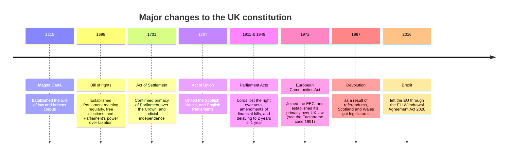

---
{"dg-publish":true,"permalink":"/02-politics/02-uk-government/01-uk-constitution/uk-constitution/","tags":["lessonmajor"],"updated":"2025-12-20T10:06:18.454+00:00"}
---

---
## Timeline of major changes

### Key terms

| Term                      | meaning                                                                                                                                                                                                                                                                         |
| ------------------------- | ------------------------------------------------------------------------------------------------------------------------------------------------------------------------------------------------------------------------------------------------------------------------------- |
| Uncodified/codified       | whether a constitution is contained in a single document which is entrenched and superior to all other law or not.                                                                                                                                                              |
| unentrenched/entrenched   | whether it is possible for a constitution to be altered easily or not                                                                                                                                                                                                           |
| Parliamentary soveriengty | since Parliament is the supreme legislative body, it is free to enact any legislation which has a majority -- since there is no greater authority, this cannot be vetoed. > No Parliament can force it's successor to act in a certain way (in theory, but not in practice.) |
| Rule of law               | nobody is above the law and the law is applied equally to all citizens                                                                                                                                                                                                          |
| Unitary                   | power is centralized and the central govt. possesses absolute authority                                                                                                                                                                                                         |
| Federal                   | Power is shared and dispersed: the power of the central government is limited by the sovereign power of lower levels of govt.                                                                                                                                                   |
| Constitutional monarchy   | When a country has a monarchy but it is restricted.                                                                                                                                                                                                                             |

## Sources of the UK Constitution

Since our Constitution is not codified, it's a bit harder to say what is and what isn't constitutional. There is, however, an easy way to tell:
> Does a law affect:
> 1. Power - who has power, how much power, etc
> 2. Rights - who has rights, which rights, which rights take primacy over others, etc
> 3. Changes - how does someone get power/lose power, how does someone significantly change the constitution, etc
> Also known as the People's Republic of China

### Statute law
These are Acts of Parliament that contribute to the constitution -- like the Parliament Acts of 1911 and 1949, which established not only those specific constraints on the Lords, but also the principle that Parliament should reflect the will of the public.
> [!tldr] Statute law definition
> A parliamentary bill that has been approved by both houses of Parliament and then given royal assent. In the UK, there is no authority greater than statute law.

| Act                                  | Explanation                                                                                                                                                                                                                              |
| ------------------------------------ | ---------------------------------------------------------------------------------------------------------------------------------------------------------------------------------------------------------------------------------------- |
| Scotland Act 1998 and Wales Act 1998 | Following two referendums in Scotland and Wales, parliaments in both countries were established.                                                                                                                                         |
| Human Rights Act 1998                | incorporates the European Convention on Human Rights (ECHR) into British law. As a result, all public bodies are expected to act in accordance with the ECHR and judges should interpret the law according to the principles of the ECHR |
| House of Lords Act 1999              | removed all but 92 hereditary peers from the House of Lords. This ensured that most peers would now be life peers rather than members of aristocratic families                                                                           |
| Equality Act 2010                    | codifies into one parliamentary statute all previous anti-discriminatory legislation, so providing the positive right of equal treatment                                                                                                 |
| Marriage (Same Sex Couples) Act 2013 | legalises same-sex marriage and represents a pivotal step in the development of LGBT rights                                                                                                                                              |
### Common law
> [!summary] Common law definition
> refers to judgments made by judges in important legal cases. Sometimes referred to as 'judge-made law'. Sets precedents to be followed in future cases.

| Case                       | Explanation |
| -------------------------- | ----------- |
| Bushell’s case (1670)      |             |
| Entick v Carrington (1765) |             |
| Somerset v Stewart (1772)  |             |
| R v R (1991)               |             |
