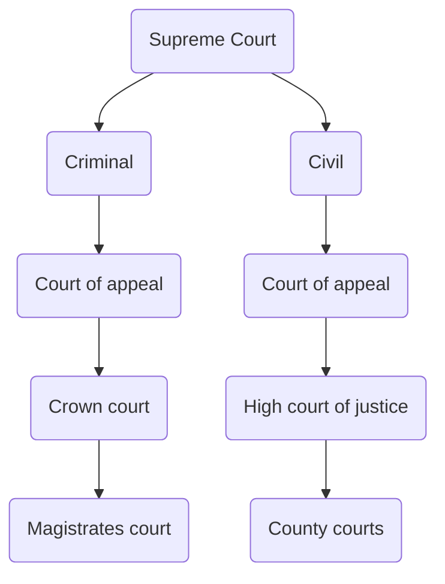

---
{"dg-publish":true,"permalink":"/02-politics/02-uk-government/04-relations-between-the-branches/the-uk-supreme-court/","tags":["lessonmajor"],"updated":"2025-12-10T13:22:13.003+00:00"}
---

**Table of Contents**

- [[02 - Politics/02 - UK government/04 - Relations between the branches/The UK supreme court#The Supreme Court\|The Supreme Court]]
	- [[02 - Politics/02 - UK government/04 - Relations between the branches/The UK supreme court#The Supreme Court\|History of the supreme Court]]
		- [[02 - Politics/02 - UK government/04 - Relations between the branches/The UK supreme court#History of the supreme Court\|The law lords]]
		- [[02 - Politics/02 - UK government/04 - Relations between the branches/The UK supreme court#History of the supreme Court\|The Constitutional Reform Act 2005]]
	- [[02 - Politics/02 - UK government/04 - Relations between the branches/The UK supreme court#The Supreme Court\|The Supreme Court now]]
		- [[02 - Politics/02 - UK government/04 - Relations between the branches/The UK supreme court#The Supreme Court now\|How is it organised?]]
		- [[02 - Politics/02 - UK government/04 - Relations between the branches/The UK supreme court#The Supreme Court now\|What is it's role?]]
			- [[02 - Politics/02 - UK government/04 - Relations between the branches/The UK supreme court#What is it's role?\|Membership of the Supreme Court]]
			- [[02 - Politics/02 - UK government/04 - Relations between the branches/The UK supreme court#What is it's role?\|Differences between the Law Lords and the Supreme Court]]
	- [[02 - Politics/02 - UK government/04 - Relations between the branches/The UK supreme court#The Supreme Court\|Relationship between the Judiciary and Parliament]]
		- [[02 - Politics/02 - UK government/04 - Relations between the branches/The UK supreme court#Relationship between the Judiciary and Parliament\|Judicial review]]
			- [[02 - Politics/02 - UK government/04 - Relations between the branches/The UK supreme court#Judicial review\|Cases of judicial review]]
- [[02 - Politics/02 - UK government/04 - Relations between the branches/The UK supreme court#Judicial independence\|Judicial independence]]
	- [[02 - Politics/02 - UK government/04 - Relations between the branches/The UK supreme court#Judicial independence\|How is independence maintained?]]
		- [[02 - Politics/02 - UK government/04 - Relations between the branches/The UK supreme court#How is independence maintained?\|How independent are they?]]
			- [[02 - Politics/02 - UK government/04 - Relations between the branches/The UK supreme court#How independent are they?\|Judicial neutrality/impartiality]]
	- [[02 - Politics/02 - UK government/04 - Relations between the branches/The UK supreme court#Judicial independence\|Why has there been tension between the judiciary and govt?]]
- [[02 - Politics/02 - UK government/04 - Relations between the branches/The UK supreme court#Is the UK Supreme Court too powerful?\|Is the UK Supreme Court too powerful?]]
	- [[02 - Politics/02 - UK government/04 - Relations between the branches/The UK supreme court#Is the UK Supreme Court too powerful?\|Should they have more power?]]
- [[02 - Politics/02 - UK government/04 - Relations between the branches/The UK supreme court#Judge-led inquiries\|Judge-led inquiries]]
	- [[02 - Politics/02 - UK government/04 - Relations between the branches/The UK supreme court#Judge-led inquiries\|Pros and cons of judge-led inquiries]]
	- [[02 - Politics/02 - UK government/04 - Relations between the branches/The UK supreme court#Judge-led inquiries\|Examples of Judge-Led Inquiries]]

## The Supreme Court
**Table of Contents**

- [[02 - Politics/02 - UK government/04 - Relations between the branches/The UK supreme court#History of the supreme Court\|History of the supreme Court]]
	- [[02 - Politics/02 - UK government/04 - Relations between the branches/The UK supreme court#History of the supreme Court\|The law lords]]
	- [[02 - Politics/02 - UK government/04 - Relations between the branches/The UK supreme court#History of the supreme Court\|The Constitutional Reform Act 2005]]
- [[02 - Politics/02 - UK government/04 - Relations between the branches/The UK supreme court#The Supreme Court now\|The Supreme Court now]]
	- [[02 - Politics/02 - UK government/04 - Relations between the branches/The UK supreme court#The Supreme Court now\|How is it organised?]]
	- [[02 - Politics/02 - UK government/04 - Relations between the branches/The UK supreme court#The Supreme Court now\|What is it's role?]]
		- [[02 - Politics/02 - UK government/04 - Relations between the branches/The UK supreme court#What is it's role?\|Membership of the Supreme Court]]
		- [[02 - Politics/02 - UK government/04 - Relations between the branches/The UK supreme court#What is it's role?\|Differences between the Law Lords and the Supreme Court]]
- [[02 - Politics/02 - UK government/04 - Relations between the branches/The UK supreme court#Relationship between the Judiciary and Parliament\|Relationship between the Judiciary and Parliament]]
	- [[02 - Politics/02 - UK government/04 - Relations between the branches/The UK supreme court#Relationship between the Judiciary and Parliament\|Judicial review]]
		- [[02 - Politics/02 - UK government/04 - Relations between the branches/The UK supreme court#Judicial review\|Cases of judicial review]]

### History of the supreme Court
#### The law lords
Until 2009, the highest court was the Appellate Committee of the House of Lords.

The fundamental problem with this was separation of powers. The law lords also had say over the laws which they would later have to enforce.
- they did rarely vote or speak in the Lords, but this was only a convention.

>[!EXAMPLE] The political role of the Law Lords
> Although they were members of the House of Lords, by convention they didn't interact, in order to ensure their independence. However, this was broken on a number of occasions;
> 1. 1996 --> Lord Hoffman proposed an amendment to the Bill of Rights in order to allow Neil Hamilton (Tory MP accused of Cash for Questions) to sue the Guardian for defamation
> 2. 1999 --> Hoffman sat on a case regarding whether former Chilean leader Augusto Pinochet could be extradited, despite being a director of Amnesty who were involved in the case
> 3. Hoffman and Scott had to be rescued from a case because they had voted against the Hunting Act 2004.
> > [!EXAMPLE] Statistics
> > Researchers found that, between 1880 and 2015, Law Lords often spoke in debates — at some point being a quarter.

#### The Constitutional Reform Act 2005

- this was part of New Labour's constitutional reforms. It aimed to:
1. **establish a supreme court to address separation of powers**
2. **change the role of Lord Chancellor** (who was, beforehand, speaker of the Lords, head of the Judiciary, and a Cabinet Minister. The act removed the Lord Chancellor as the speaker and head of judiciary, although by convention the Lord Chancellor is still the head of the judiciary.)
>[!WARNING] Be careful!
> although this suggests that the Lord Chancellor still has a lot of power over appointments, in reality he is expected to accept the recommendation of the Selection Commission.
3. **creation of the judicial appointments commission** — the Lord Chancellor lost the ability to make judicial appointments and this was given to an independent commission.

### The Supreme Court now
#### How is it organised?
- made up of 12 justices, with one head and one deputy. Contains justices from all countries in Great Britain guaranteed.
	- 11 of the 12 Law Lords joined the Supreme Court
- Not all members sit on cases. The more important a case, the more justices sit (like the Miller cases.)

#### What is it's role?
1. final court of appeal in both civil & criminal cases in all British countries except Scotland.
2. It hears issues of public importance
3. it concentrates on cases of the greatest public and constitutional importance
4. it upholds the common law
5. it adjudicates on devolution matters

>[!EXAMPLE] Supreme Court adjudicating on devolution
>The first case on devolution in the court was Martin and Miller v. Lord Advocate 2010. 
>> this was because the Scottish Parliament tried to legislate on reserved powers, within the purview of Westminster.
>> The issue surrounded driving offences, which are legislated on by Westminster. However, Scotland believed that if these offences were 'criminal', Scotland could legislate on it as it controls it's criminal law.
>> > the supreme court upheld Scotland's right to do this.
>
> Another case occurred after the Scottish Parliament passed the draft Scottish Independence Referendum Bill. This called for a second referendum to be held in 2023 on the same terms as in 2014. This was sent to the court over whether this was within the Scottish Parliament's power. 
> >The court ruled that it wasn't, denting the SNP's plans

##### Membership of the Supreme Court
There have been 33 justices total since it's creation.
- 28 have been male, 5 female
- 26 were privately educated, 6 were state educated
- 29 attended Oxbridge, 4 did not

There are arguments for and against proportional representation (also known as descriptive representation) within the judiciary.

| It matters                                                                              | It doesn't matter                                                                      |
| --------------------------------------------------------------------------------------- | -------------------------------------------------------------------------------------- |
| Makes it more legitimate and trustworthy                                                | Undermines the quality of justices if they aren't qualified                            |
| Makes better decisions with a wider range of perspectives                               | Judges chosen on background may not be able to make impartial decisions                |
| Diverse justices are more likely to understand challenges faced by minorities in the UK | Undermines the aim of increasing diversity — should just be equal opportunity, not DEI |

##### Differences between the Law Lords and the Supreme Court
**Similarities**
- the manner in which the court hears cases is very similar, most coming from the Court of Appeal
- the composition is mostly similar
- Early decisions were similar in opinion to the Law Lords
- cases are usually heard by 5 justices 
- level of power is the same
- tension between Judges and Politicians existed before the reform
**Differences**
- transparency. The Court uses social media, publishes press summaries of cases, and is streamed online when possible.
	- appointments also 
- clearer separation of powers
	- physical separation by building
- more visible (cameras)
- Rulings are passed down in a clearer way with press summaries
	- greater scrutiny by the public

Some argue that there hasn't been any fundamental change from the Law Lords. For example, the court's rulings have been mainly regarding the concept of the government acting *Ultra Vires* (beyond the law) and making  'declarations of incompatibility' under the HRA.

### Relationship between the Judiciary and Parliament

In the US, the Supreme Court can check a law as 'unconstitutional', because the Constitution is sovereign.
- in the UK, Parliament is sovereign. You can imagine the difference in powers, now

1. in the UK, judges **do** have to account the wishes of Parliament
	1. their job is, partly, to 'fill the gaps' in State Law, because obviously Statute Law isn't going to be 100% perfect and account for all situations.
2. Parliament can say 'nu uh' to any ruling by just making a new law

>[!EXAMPLE] Examples
> **Rwanda Plan 2023**: In 2023, the court rules that the Govt. plans to send asylum seekers to Rwanda was unlawful. This was because Rwanda was not deemed a safe third country.
> > Parliament consequently passed the Safety of Rwanda Act that changed this.
> 
> **Terrorist Asset-Freezing Act 2010**: HM Treasury v. Mohammed Jabar Ahmed ruled that the Govt. acted unlawfully by freezing the assets of suspected terrorists. 
> > The govt. didn't like this, so they convinced Parliament to pass the aforementioned Act.

#### Judicial review

Judicial review is when the court reviews the actions of the govt. or a public body to consider whether they have acted beyond the law — also known as *Ultra Vires*.

This can be split further:
1. **illegality**: an action not taken in accordance with the law that regulates it *or* goes beyond the powers delegated to that body
2. **irrationality**: an action was not taken reasonably
3. **irregularity**: a failure to consult or act in accordance with 'natural justice' — or with the underpinning procedural rule of carrying out the law.

Only ~5% of judicial review cases reach the supreme court. Most are withdrawn, refused, or settled outside of court.

>[!EXAMPLE] Conservative election manifesto
> in their 2019 election manifesto, the Tories pledged to *'ensure judicial review is available to protect the rights of the individuals against an overbearing state, whilst ensuring that it is not abused to conduct politics by other means or create needless delays.'*
> This was put into action through the **Judicial Review and Courts Act 2022**. This act:
> - protected certain decisions from judicial review
> 	- particularly regarding immigration and human rights
> - it introduced suspended quashing orders
> 	- this means that a judge can set a time limit for the Government tor rectify it's error, rather than immediately quashing it.
> Critics said was an attempt to limit the power of the judiciary, especially after **Miller v. Prime Minister** — a decision which the govt. did not approve of. 
> > However, the Tory govt. argued that there were simply too many judicial review cases, and the courts couldn't cope.

##### Cases of judicial review

| Name                                                                   | Background                                                                                                                                                                                                                                                                                                                                                                                                                                                                                                                                                                                                                                                                                                                       | Issue                                                                                                                                                                                                                                                                                                                                                                                                                                      | High Court decision                                                                                                                                                                                                                                                                                            | Supreme Court decision                                                                                                                                                                                                                                                                                                                                                                                                                                  |
| ---------------------------------------------------------------------- | -------------------------------------------------------------------------------------------------------------------------------------------------------------------------------------------------------------------------------------------------------------------------------------------------------------------------------------------------------------------------------------------------------------------------------------------------------------------------------------------------------------------------------------------------------------------------------------------------------------------------------------------------------------------------------------------------------------------------------- | ------------------------------------------------------------------------------------------------------------------------------------------------------------------------------------------------------------------------------------------------------------------------------------------------------------------------------------------------------------------------------------------------------------------------------------------ | -------------------------------------------------------------------------------------------------------------------------------------------------------------------------------------------------------------------------------------------------------------------------------------------------------------- | ------------------------------------------------------------------------------------------------------------------------------------------------------------------------------------------------------------------------------------------------------------------------------------------------------------------------------------------------------------------------------------------------------------------------------------------------------- |
| **Treasury v Mohammed Jabar Ahmed and others (2010)**                  | Three brothers under investigation by police for suspected terrorist links, none charged with terrorism-related offences. However, in 2007, the Treasury said they had reasonable grounds for suspecting terrorist links. All three denied this. The Treasury subjected them to an 'asset freeze', meaning their money couldn't be moved abroad.                                                                                                                                                                                                                                                                                                                                                                                 | Whether in freezing the assets of suspected terrorists using a UN Terrorism Order, the govt. had acted Ultra Vires.                                                                                                                                                                                                                                                                                                                        | 2009 — ruled that the govt. was acted ultra vires                                                                                                                                                                                                                                                              | Govt. appealed. Supreme Court ruled the same as the High Court.                                                                                                                                                                                                                                                                                                                                                                                         |
| **R v Chaytor and others (2010)**                                      | After the MP's expenses scandal, 8 MPs were criminally charged. These included: >David Chaytor (Labour) – Guilty of false accounting of £18,350. Sentenced to 18 months imprisonment. >> and others These MPs argued that their actions were protected by parliamentary privilege as the expenses were necessary for them to fulfil their role as MPs. They then argued that the Crown (criminal) Court had no jurisdiction and the conviction should be overturned.                                                                                                                                                                                                                                                    | Whether the otherwise illegal actions taken were not the jurisdiction of the criminal courts because they were privileged.                                                                                                                                                                                                                                                                                                                 | Dismissed the arguments of the MPs. Parliamentary authorities did not see the actions as privileged, and that the expenses weren't essential, and that privilege doesn't cover ordinary criminal actions.                                                                                                      | Agreed with the lower court. No legal basis for criminal acts committed outside Parliament are protected by parliamentary privilege.                                                                                                                                                                                                                                                                                                                    |
| **Evans vs Attorney General (2015)**                                   | in 2010, a Guardian journalist became aware that Prince Charles had been sending private letters to govt. ministers, nicknamed 'spider letters.' The journalist applied under the FOI Act for the letters to be disclosed, because it was in the public interest. The govt. refused, arguing that they were written expecting confidentiality, and disclosing them would damage Charles' ability to be King in the future.                                                                                                                                                                                                                                                                                                       | Whether communications between a member of the Royal Family (notably the next in line) and govt. ministers were disclosable under the Freedom of Information Act, or if it was an exception due to Sections 37, 40, and 41, which: >limited disclosure of comms with the monarch or heir >any info deemed personal data within the Data Protection Act >info provided in confidence would be a breach of confidence if disclosed. | Upper Tribunal ruled that many of the letters — some of which were political in nature — should be disclosed. But the then Attorney-General overruled this.                                                                                                                                                    | They ruled that the Attorney-General did not have the right to veto the disclosure of the letters, and reverted to the decision taken by the Upper Tribunal.                                                                                                                                                                                                                                                                                            |
| **Miller vs Secretary of State for Exiting the European Union (2017)** | In 2016, Brits voted to leave the EU. To do this, the Govt. had to send an Article 50 declaration to the EU. The govt. planned to trigger this without parliamentary consent, believing they already had the mandate from the referendum. However, Gina Miller brought a case that argued that Parliament needed to consent.                                                                                                                                                                                                                                                                                                                                                                                                     | Whether, having joined the EU through statute law, the Government could withdraw using royal prerogative powers.                                                                                                                                                                                                                                                                                                                           | Ruled that, as Britain joined the EU via an Act of Parliament, they had to leave by an Act of Parliament.                                                                                                                                                                                                      | Supreme Court upheld the lower court's decision.                                                                                                                                                                                                                                                                                                                                                                                                        |
| **Steinfield and Keiden v Home Secretary (2018)**                      | in 2004, the Civil Partnerships Act was passed, granting same-sex couples the right to seek a civil partnership. There were some differences though: 1. adultery was grounds for divorce but not dissolution of a civil partnership. Many straight couples argued that this was discriminatory under the ECHR and the HRA. The govt. argued that the CPA was designed to give gay couples rights that they did not have otherwise, and so was proportionate means to achieve a legitimate aim. However, after the Same-Sex Marriage Act (2013) passed, this was a weak argument. A couple decided to launch a judicial review challenge.                                                                                   | Whether precluding straight couples from entering into civil partnerships was discriminatory & non-compatible with human rights laws.                                                                                                                                                                                                                                                                                                      | Rejected the arguments of the couple. 'The difference in treatment complained of does not infringe a personal interest close to the core of the right to family life, still less the right to private life protected (by the ECHR.)'                                                                           | The Supreme Court ruled that the procedures were ultra vires. They found that although precluding heterosexual couples from a civil partnership had originally been legitimate and proportionate, this position was no longer possible to maintain now that same-sex couples had equal marriage rights. The Court decided that the elements of the CPA that precluded it as an option for same-sex couples were incompatible with Article 8 of the ECHR |
| **Lee v. Ashers Baking Company Ltd and others (2018)**                 | in 2014, a volunteer for an LGBT organisation in Belfast entered a shop and ordered a custom made cake, in order to mark anti-homophobia week. He had previously bought cakes from that shop without issue. He asked for the cake to have gay stuff on it, and the order was taken and paid for. Afterwards, the owner phoned the activist to tell him they couldn't do it because they were Christians. The activist took them to court claiming discrimination over sexual orientation and political opinion. The bakery argued that they could refuse because they didn't do it on the basis of him being gay, but because they didn't support the political message, and were acting within freedom of political expression. | Whether the activist has been discriminated against based on sexual orientation, and secondly, whether a business can cite religious or political beliefs in refusing service to a customer.                                                                                                                                                                                                                                               | A court ruled in Lee's (the activist) favour, but was appealed higher, making the N. Irish govt. party to the case. The Attorney-General requested the case go to the Supreme Court because of conflict between the ECHR and N. Irish law. The Court of Appeal rejected this, and agreed with the lower court. | The Supreme Court ruled in favour of the bakery, distinguishing the message ('support gay rights') from being homosexual. They ruled that the bakers could not be obliged to take an action that they profoundly disagreed with due to their own political beliefs.                                                                                                                                                                                     |
| **Miller v. Prime Minister (2019)**                                    | In 2019, Parliament was prorogued on the advice of the PM, Johnson. The govt. claimed that it was necessary as parliament had sat for 341 days, longer than most cases. However, the length of the proposed prorogation was 3 weeks, when most were 1 week. The govt. was suspected of doing this in order to stop MPs from debating on Brexit to put pressure on parliament to accept a deal before the deadline.                                                                                                                                                                                                                                                                                                               | First, whether the PM prorogued parliament in order to stifle parliamentary scrutiny, (which would be Ultra Vires), and second, whether — as a political decision — it was subject to judicial review.                                                                                                                                                                                                                                     | Ruled that the case wasn't under judicial review, so it wasn't within their power to make a judgement. Although, a Scottish Court found it unlawful.                                                                                                                                                           | The case heard was an amalgamation of appeals for two separate cases: the Scottish and English ones. The court ruled that Johnson's prorogation was unlawful. They stressed that the govt.'s motives weren't a central issue, it was that the prorogation stifled parliamentary debate, which was undemocratic, and stopped parliament carrying out it's functions without reasonable justification.                                                    |
 
## Judicial independence
**Table of Contents**

- [[02 - Politics/02 - UK government/04 - Relations between the branches/The UK supreme court#How is independence maintained?\|How is independence maintained?]]
	- [[02 - Politics/02 - UK government/04 - Relations between the branches/The UK supreme court#How is independence maintained?\|How independent are they?]]
		- [[02 - Politics/02 - UK government/04 - Relations between the branches/The UK supreme court#How independent are they?\|Judicial neutrality/impartiality]]
- [[02 - Politics/02 - UK government/04 - Relations between the branches/The UK supreme court#Why has there been tension between the judiciary and govt?\|Why has there been tension between the judiciary and govt?]]

Judicial Independence is the notion that judges should be a separate entity from the other branches of government. Judicial Independence is necessary to truly uphold the Rule of Law. The opposite of Judicial Independence is Judicial Activism. This is the term given when the judiciary have a more active role in the political system. Increasingly, despite the changes made in the Constitutional Reform Act (2005), it may actually be becoming harder for judges to maintain political independence.

### How is independence maintained?

1. **Security of Tenure**: they can only be removed by a vote in both Houses of Parliament
2. **Guaranteed salaries**: judge pay isn't set by politicians — so they don't have to impress them to get a pay rise.
3. **Contempt of Court**: it is a criminal offence for politicians to speak about a criminal case during the proceedings, in order to stop cases being politicised
4. **The Judicial Appointments Commission**: avoids previous Cronyism
5. **Reputation**: Judges rely on their reputation for impartiality for career advancements. Most judges are unwilling to become politicised.

#### How independent are they?

| They are independant                                                                                                                                                           | Theme                   | They aren't independant                                                                                                                                                                                                                                                                                                                                                                       |
| ------------------------------------------------------------------------------------------------------------------------------------------------------------------------------ | ----------------------- | --------------------------------------------------------------------------------------------------------------------------------------------------------------------------------------------------------------------------------------------------------------------------------------------------------------------------------------------------------------------------------------------- |
| Since the CRA 2005, the powers have been less entangled and more politically independant                                           | seperation of powers    | Recent govt. policies have been designed to limit the power of the judiciary by reducing their role in judicial review, seen not only in the Judicial Review and Courts Act but also in the policy of removing the majority of legal aid available for people to challenge for their rights in court. |
| The creation of the Appointments Commission means that political influence means little when appointing judges.                                                                | structural independance |                                                                                                                                                                                                                                                                                                                                                                                               |
| The structural safeguards (pay and tenure) ensure they are independant                                                                                                         | structural independance |                                                                                                                                                                                                                                                                                                                                                                                               |
| They often practice judicial restraint, only overturning a decision if there is a clear necessity.                                                                             | restraint               | The HRA means that the courts have to judge in controversial political matters.                                                                                                                                                                                                                                                                   |
| By convention, govt. ministers respect the decisions of the court and do not publicly question the decisions. They also usually don't comment on the likely outcome of a case. | Executive interactions  | Govt. ministers have become increasingly willing to question the courts. Notably, in Brexit, after the rulings on Brexit v. Miller and Miller. V Prime Minister (a.k.a. Miller/Cherry)                                                                                                                                                            |

##### Judicial neutrality/impartiality

| They are neutral                                                                                                                                                                             | Theme            | They aren't neutral                                                                                                                                                                                                                                                     |
| -------------------------------------------------------------------------------------------------------------------------------------------------------------------------------------------- | ---------------- | ----------------------------------------------------------------------------------------------------------------------------------------------------------------------------------------------------------------------------------------------------------------------- |
| Judges rely on their reputation for neutrality to progress their careers, and they are unlikely to risk that reputation.                                                                     | Reputation       | The media has become increasing hostile to the judiciary. After the ruling with Miller on Miller v. Brexit, the Daily Mail carried a headline 'Enemies of the People'.  > This can make judges appear to be not neutral. |
| Judges are forbidden from engaging in political issues and are careful about offering comment.                                                                                               | Political issues | Senior judges have, at times, felt forced to defend their neutrality. Lord Neuberger was critical of the govt. after Miller v. PM for not being forceful enough in their defence of the judiciary (after the media attacks) |
| The judiciary operates on the principle of transparency. Almost all cases are open to the public and some are streamed.                                                                      | Transparency     | Refer to the point on the media.  Also, there isn't much public attention on the Supreme Court, despite transparency.                                                                                                                                                |
| it's become more diverse. By 2020, women appointments to the High Court and above was 26% compared to 13% before the commission was established. | Representation   | The senior judiciary is far from representative and is still taken from a narrow social and educational background.                                                                                                                                                     |
| Judges are only appointed after long careers                                                                                                                                                 | Bias             | the judiciary is perceived to have left-wing bias.                                                                                                                                                                                                                      |
| Appeals cases are heard by multiple judges, so they can check each other's neutrality.                                                                                                       | Bias             | the judiciary is perceived to have left-wing bias, leading to concerns that the judiciary is more concerned with protecting individual rights over collective rights.                                                                                                   |
| Judges are often trusted to lead inquiries into controversial political issues, such as the [[02 - Politics/02 - UK government/04 - Relations between the branches/The UK supreme court#Examples of Judge-Led Inquiries\|Saville Inquiry]].                       |                  | Inquiries suck major balls.                                                                                                                                                                                                                                             |
### Why has there been tension between the judiciary and govt?

1. **Sentencing**: politicians often think that judges are too lenient. The govt. have the right to seek review of sentences through the 'unduly lenient' scheme. This happened in the case of Wayne Couzens, murderer of Sarah Everard. 
2. **Parole**: politicians don't like when judges rule that prominent prisoners should be given parole. In the past, the Home Secretary could ensure a prisoner be imprisoned for life. Recently, Dominic Raab criticised the Parole Board for agreeing to release Tracy Conolly, murderer of Baby P (related of the Letby case) 
3. **Judicial review**: obviously, Conservatives have attempted to limit judicial review from the start of Johnson's premiership.
4. **Rights**: there is tension over rights. The govt. wants to emphasis public protection over individual rights, but the courts often consider differently. This can be seen in A. v. Home Secretary 

> In March 2025 a row occurred after the Sentencing Council published new guidelines that said that a criminal’s ethnic background should be taken into account when setting a sentence. The government are concerned that this creates a “two-tier” legal system, with someone being treated differently because of their background. As a result, the government is considering legislation to force the Sentencing Council to change their guidelines. 

>[!TIP] Politicians on respecting the independence of the judiciary
> Traditionally, it was expected that senior politicians would be careful in what they publically said about the judiciary, in order to respect it's independence. However, in recent years this convention has been less respected:
> > In 2025, during the Tory party conference, Robert Jenrick faced criticism for comments he made in his conference speech on 'activist' judges. Jenrick, the Shadow Justice Secretary, said that under the Tories, govt. ministers would have a greater involvement in the appointment of judges to stop '[judges] who blur the line between adjudication and activism.'
> 
> > Also in 2025, Kier Starmer publicly criticised a court decision to grant a Palestinian family the right to remain in the UK. The comment was made in PMQs. The Chief Justice of England and Wales said she was deeply concerned that he remarked this publically.

----
## Is the UK Supreme Court too powerful?

| Powerful                                                                                                                              | Theme             | Weak                                                                                                                                                                                                   |
| ------------------------------------------------------------------------------------------------------------------------------------- | ----------------- | ------------------------------------------------------------------------------------------------------------------------------------------------------------------------------------------------------ |
| the ability of the court to rule that the govt. acted *ultra vires*, even on controversial political decisions (Miller/Cherry)        | govt interactions | the court have to abide by parliamentary law. The govt. always has a majority in parliament. Do you see the problem?                                                                                   |
| the ability of the court to rule that the govt. acted contradictory to the HRA gives them power over elected officials                | sovereignty       | the court cannot strike laws passed by Parliament, and has to abide by established law (parliament can just make new laws.) Parliament cannot be forced to take any action that they do not wish to |
| there has been a huge increase in the number of judicial review cases, which has led to them making more rulings on political matters | judicial review   | the court cannot initiate cases and relies on cases being brought forward.  most review cases are dismissed before making it to court.                                                           |

### Should they have more power?

| more power                                                                                                                                                                                                                       | Less power                                                                                                                                                                          |
| -------------------------------------------------------------------------------------------------------------------------------------------------------------------------------------------------------------------------------- | ----------------------------------------------------------------------------------------------------------------------------------------------------------------------------------- |
| they have a key role — particularly in conducting reviews, in ensuring that the government operates within the law and doesn't abuse their power. Also, see the point at the bottom on short-term public mood.                   | They are unelected and so unaccountably to the electorate and can make decisions not taking into account national interest or public opinion.                                       |
| Judges are not politicians and are independent from politics. They are, therefore, in a strong position to prevent abuses of power by governments who may wish to gain political advantage. They also uphold the rule of law. | Judges can make rulings that prevent the govt. from carrying out it's functions and political mandate. Because the govt is elected, democracy demands that the govt should prevail. |
| They have a role in ensuring that human rights and freedoms are upheld.                                                                                                                                                          | When upholding EU law of the ECHR, the courts are arguably challenging Parliamentary sovereignty, a key constitutional principle.                                                   |
| While judges vary in opinion and background, they operate strictly within the law and so prevent abuses of power or rights which make take place merely to satisfy short-term public mood.                                       | The senior judiciary is out of touch and unrepresentative — being mostly privately educated and male.                                                                               |

---
## Judge-led inquiries
**Table of Contents**

- [[02 - Politics/02 - UK government/04 - Relations between the branches/The UK supreme court#Pros and cons of judge-led inquiries\|Pros and cons of judge-led inquiries]]
- [[02 - Politics/02 - UK government/04 - Relations between the branches/The UK supreme court#Examples of Judge-Led Inquiries\|Examples of Judge-Led Inquiries]]

### Pros and cons of judge-led inquiries

| Pros                                                                                                                                                                                                    | Cons                                                                                                                                                                                            |
| ------------------------------------------------------------------------------------------------------------------------------------------------------------------------------------------------------- | ----------------------------------------------------------------------------------------------------------------------------------------------------------------------------------------------- |
| They allow controversial issues to be considered beyond the political arena. The evidence-based approach and independence of those leading them adds significantly to the legitimacy of their findings. | Many inquiries take an extremely long time to publish. Notably, the Chilcott Inquiry published its findings much later than planned. This led to much frustration by the public.                |
| People are much more likely to trust an independent inquiry that has been carried out than an inquiry carried out by Parliament.                                                                        | Inquiries are often hugely expensive. For example, the Bloody Sunday Inquiry cost £210.6 million pounds. The main reason for this cost is the legal expertise that is needed to carry them out. |
| Statutory Inquiries can take evidence under oath and can subpoena witnesses. This allows for the public to trust that those given evidence is doing so truthfully.                                      |                                                                                                                                                                                                 |

### Examples of Judge-Led Inquiries

 **Saville Inquiry (1998-2010):** During the height of the Troubles in Northern Ireland up to 21,000 British troops were deployed in a peacekeeping operation. On the 30th January 1972 a march was held in Londonderry in protest of republicans who had been held without trial by the British government. The 1st Battalion of the parachute regiment were deployed to the area. On arrival the paratroopers were ordered to arrest rioters. The situation escalated quickly and a number of shots were fired by the British Army. In total, 26 people were shot and 14 people were killed.

 The Saville Report was published on the 15th June 2010. The report was clear that British Soldiers were to blame for the killings. Saville found that British soldiers on that day had “lost control” and that they should never have been in the Bogside area in the first place. The report also found that British soldiers had colluded to cover the truth in the aftermath of the incident. On the day that report was published David Cameron, just two months into his tenure as Prime Minister, addressed the House of Commons and apologised on behalf of the British Government.

 **Hutton Inquiry (2003)**: The Hutton inquiry was a 2003 investigation into the 2003 death of David Kelly, a UN weapons inspector in Iraq. The investigation was led by Lord Hutton, a judge and the head of the Court of Appeal. David Kelly had been the source of suggestions by BBC journalist Andrew Gilligan that the Iraq Dossier had been ‘sexed up’ by Tony Blair’s government in order to win support for war in Iraq. The inquiry delved deep into the heart of the Tony Blair government and particularly, the relationship between Tony Blair’s government and the Press.

 **Leveson Inquiry (2011-2012)**: In reaction to the Phone Hacking Scandal, Lord Leveson led an independent inquiry into the issue. This went to the heart of David Cameron’s government, because the editor of the News of the World during the scandal, Andrew Coulson, had gone on to become David Cameron’s Director of Communications. Most embarrassing for the government, was the seemingly intimate relationships between all recent governments and the media mogul, Robert Murdoch.