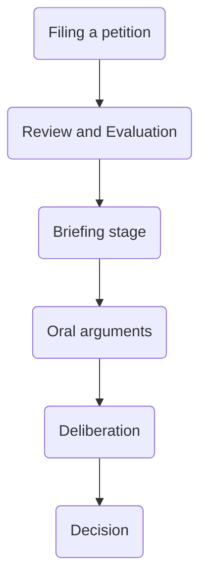

---
{"dg-publish":true,"permalink":"/02-politics/03-usa/the-supreme-court/civil-rights-and-civil-liberties/","updated":"2025-12-02T12:35:47.092+00:00"}
---

#lessonmajor

**Table of Contents**

- [[#Civil rights|Civil rights]]
- [[#Race and rights|Race and rights]]

---
## Civil rights
### How does a case get to the Supreme Court?

This is a long and expensive process. The average case lasts around 6 months -> 1 year, although some can last several years. The cost of taking a case all the way up to the Supreme Court can run into the hundreds of thousands or even millions of dollars in legal fees and expenses. 

### Supreme Court rulings on public policy

| Case name                                                            | Year | Brief outline                                                                                                                                                        | Policy area         | Final vote | Outcome                                                                                                     |
| -------------------------------------------------------------------- | ---- | -------------------------------------------------------------------------------------------------------------------------------------------------------------------- | ------------------- | ---------- | ----------------------------------------------------------------------------------------------------------- |
| Mahmoud v Taylor                                                     | 2025 | Parents objected to schools using books which included LGBTQ+ characters, arguing they should be able to withdraw their children because of their religious beliefs. | Religion/education  | 6-3        | The court agreed with the parents: schools must allow families to opt out for religious reasons.            |
| Texas Porn Age-verification Law                                      | 2025 | Wether Texas could require proof of age before viewing porn online. Critics said it limited free speech and invaded privacy.                                         | Free speech/privacy | 6-3        | The court upheld the law, saying that protecting children is more important than privacy and speech rights. |
| United States v. Zubaydah                                            | 2022 | Can the government invoke state secrets privilege to withold information about CIA black sites.                                                                      | National security   | 7-2        | Government's invocation of state secrets privilege upheld.                                                  |
| Trump v Thompson                                                     | 2022 | Could Trump block the release of documents to the House committee investigating the Jan 6th attack                                                                   | Executive privilege | 8-1        | Former President's claim to executive privilege overruled.                                                  |
| National Federation of Independent Businesses v Department of Labour | 2022 | Was Biden's administration vaccine-or-testing mandate for large employers exceeding OSHA's authority?                                                                | Public health       | 6-3        | Vaccine-or-testing mandate for large employers not lawful.                                                  |
| Biden v. Missouri                                                    | 2022 | Was the Biden administration's mandate for healthcare workers at facilities receiving federal money to be vaccinated legal?                                          | Public health       | 5-4        | Vaccine mandate for healthcare workers lawful.                                                              |
| Bostock v. Clayton County                                            | 2020 | Concerned whether the Civil Rights Act 1964 protects employees against discrimination badsed on sexual orientation or gender identity.                               | Civil Rights        | 6-3        | Discrimination based on sexual orientation or gender identity prohibited.                                   |
| June Medical Services LLC v. Russo                                   | 2020 | Considered a Louisiana law requiring doctors performing abortions to have admitting prileges at nearby hospitals                                                     | Reproductive rights | 5-4        | Louisiana abortion law struck down.                                                                         |
| California v. Texas                                                  | 2021 | Reviewed the constitutionality of the ACA after the individual mandate penalty was set to $0                                                                         | Healthcare          | 7-2        | ACA upheld.                                                                                                 |
| Futon v. City of Philadelphia                                        | 2021 | Concerned whether the city of Philadelphia could refuse to contract with a catholic foster care agency that would not certify same-sex couples as foster parents.    | Civil Rights        | 9-0        | City's refusal to contract with the agency due to the same-sex couple policy was ruled unconstitutional.    |

### Civil Liberties and rights and recent rulings

| Right                                           | Constitution?        | Protections                                                                                                                                                                                                                                                                                                                                                                                                                                                                                                  | Infringements                                                                                                                                                                                                                                                                                                                                                                                                                                                                                                                                     |
| ----------------------------------------------- | -------------------- | ------------------------------------------------------------------------------------------------------------------------------------------------------------------------------------------------------------------------------------------------------------------------------------------------------------------------------------------------------------------------------------------------------------------------------------------------------------------------------------------------------------ | ------------------------------------------------------------------------------------------------------------------------------------------------------------------------------------------------------------------------------------------------------------------------------------------------------------------------------------------------------------------------------------------------------------------------------------------------------------------------------------------------------------------------------------------------- |
| Freedom of religion                             | 1st                  | 2017, Trump: Executive Order 13798 told federal agencies to prioritise religious liberty. 2021, Fulton v Philadelphia: Court backed a Catholic foster agency’s right to operate within its beliefs.  2022, Carson v Makin: States that fund private schools could not exclude religious ones just for being religious.  2022, Kennedy v Bremerton: A school coach could pray briefly and privately after matches.  2023, Groff v DeJoy: Employers had to try harder to accommodate religious needs. | 2023, 303 Creative v Elenis: A business could refuse a same-sex wedding commission on free-speech grounds, which critics say can reduce protection for LGBTQ+ customers when religion is cited.                                                                                                                                                                                                                                                                                                                                                   |
| Freedom of Speech                               | 1st                  | 2017, Matal v Tam and 2019, Iancu v Brunetti: Government could not ban “offensive” trademarks, reinforcing strong speech protection.  2023, Counterman v Colorado: Online messages count as criminal threats only where the speaker was at least reckless, which protects borderline speech.                                                                                                                                                                                                              | 2018, FOSTA-SESTA: Aimed at tackling online sex trafficking but made websites more legally exposed, which critics say chilled lawful speech.  2020, Trump EO on social media: Sought to pressure platforms over moderation, raising concerns about state influence on online speech.                                                                                                                                                                                                                                                           |
| Freedom of the press                            | 1st                  | 2021, Biden DOJ policy: Made it much harder to seize reporters’ phone or email records in leak cases, which supported investigative journalism.                                                                                                                                                                                                                                                                                                                                                              | 2025, DOJ change: The new administration loosened those protections, making subpoenas for journalists’ records easier again, which press-freedom groups warned could deter sources.                                                                                                                                                                                                                                                                                                                                                               |
| Freedom of assembly (aka protest)               | 1st                  | 2020–24: Reviews of protest policing led to training and policy changes in some agencies, aimed at protecting peaceful protest while managing disorder.                                                                                                                                                                                                                                                                                                                                                      | 2020, Trump EO on monuments and federal deployments to some cities: Tactics used around protests were criticised for deterring lawful assembly and escalating confrontations.                                                                                                                                                                                                                                                                                                                                                                     |
| Right to keep and bear arms                     | 2nd                  | 2022, NYSRPA v Bruen: Made it easier to get a permit to carry a handgun in public. 2024, United States v Rahimi: Kept guns from people under domestic-violence restraining orders, showing the Court will uphold some safety limits. 2024, Garland v Cargill: Struck down the bump-stock ban as beyond agency power, clarifying limits on executive action                                                                                                                                                   | 2018, ATF bump-stock rule under Trump: Banned bump stocks after the Las Vegas shooting but was later invalidated in 2024, showing that agency rules can be rolled back by courts. 2022–25, Biden “ghost gun” rule: Tightened controls on home-built kits, then faced unfavourable rulings in 2025 that weakened the rule.                                                                                                                                                                                                                         |
| Protection from unreasonable searches           | 4th                  | 2018, Carpenter v United States: Police generally need a warrant for your phone’s location history. 2021, Caniglia v Strom: Police could not enter a home without a warrant using a broad “caretaking” excuse.                                                                                                                                                                                                                                                                                               | 2018 and 2024, FISA Section 702 renewals: Kept broad surveillance powers for foreign intelligence. Critics say Americans’ data can still be caught up, which is why privacy groups push for tighter safeguards.                                                                                                                                                                                                                                                                                                                                   |
| Right to due process                            | 5th                  | 2018, Sessions v Dimaya: Struck out a vague deportation rule, demanding clearer standards. 2020, Title IX in universities: New rules required live hearings and cross-examination in serious misconduct cases, framed as strengthening fairness for the accused.                                                                                                                                                                                                                                             | 2024–25, Title IX changes: Biden’s 2024 update broadened protections against sex-based discrimination, but courts paused major parts and a nationwide ruling in early 2025 vacated the package, leaving campuses with uncertainty about procedures.  2025, The Supreme Court’s ruling in Noem v Perdomo weakens Fourth Amendment protections by allowing ICE to resume roving patrols based on appearance or language, lowering the threshold for suspicion and increasing risks of profiling and unreasonable searches in Latino communities. |
| Protection against self-incrimination           | 5th                  | 2022, Vega v Tekoh: Miranda warnings still apply, but you cannot automatically sue an officer for damages just because they failed to give the warning, so the remedy is narrower.                                                                                                                                                                                                                                                                                                                           | Same case as the protection cell demonstrates the limit in practice, so teachers should explain that Miranda remains, but suing over a breach is harder.                                                                                                                                                                                                                                                                                                                                                                                          |
| Right to an impartial jury                      | 6th                  | 2020, Ramos v Louisiana: State criminal juries must be unanimous, which strengthens fairness at trial.                                                                                                                                                                                                                                                                                                                                                                                                       | 2022, Shinn v Martinez Ramirez: Made it harder for prisoners to use new evidence later to show their trial lawyer was ineffective, which critics say weakens a key safety net.                                                                                                                                                                                                                                                                                                                                                                    |
| Right to confront witnesses                     | 6th                  | 2022, Hemphill v New York: Prosecutors could not rely on hearsay to dodge cross-examination simply because they thought the defence case was “misleading”.                                                                                                                                                                                                                                                                                                                                                   | —                                                                                                                                                                                                                                                                                                                                                                                                                                                                                                                                                 |
| Right to legal counsel                          | 6th                  | 2018, McCoy v Louisiana: A lawyer could not admit guilt against the client’s wishes. 2019, Garza v Idaho: If a client asks for an appeal, the lawyer must file it, even after an appeal waive                                                                                                                                                                                                                                                                                                                | 2022, Shinn v Martinez Ramirez: As above, narrowed chances to fix wrongful convictions due to poor lawyering at an earlier stage.                                                                                                                                                                                                                                                                                                                                                                                                                 |
| Trial by jury in civil cases                    | 7th                  | 2024, SEC v Jarkesy: When the government seeks civil penalties for fraud, it must use a jury in federal court rather than in-house hearings, which boosts the civil jury’s role                                                                                                                                                                                                                                                                                                                              | —                                                                                                                                                                                                                                                                                                                                                                                                                                                                                                                                                 |
| Protection against excessive fines              | 8th                  | 2019, Timbs v Indiana: Applied the excessive-fines rule to states and local authorities, important for things like vehicle seizures in drug cases.                                                                                                                                                                                                                                                                                                                                                           | —                                                                                                                                                                                                                                                                                                                                                                                                                                                                                                                                                 |
| Protection against cruel and unusual punishment | 8th                  | 2021, Biden DOJ moratorium: Paused federal executions while policies were reviewed.                                                                                                                                                                                                                                                                                                                                                                                                                          | 2020–21, federal executions resumed: Thirteen took place at the end of Trump’s first term, raising debate about humane protocols.  2025: The new administration signalled the moratorium would end, reopening the question.                                                                                                                                                                                                                                                                                                                    |
| Unenumerated rights and privacy                 | 9th                  | 2024, FDA v AHM: Access to abortion medication stayed in place after the case was dismissed on standing grounds, so nothing changed for users. 2024, Moyle v United States: Emergency abortions in hospitals could continue in life-threatening cases while the case proceeds.                                                                                                                                                                                                                               | 2022, Dobbs v Jackson Women’s Health: Ended the federal constitutional right to abortion and left rules to the states, many of which tightened restrictions.                                                                                                                                                                                                                                                                                                                                                                                      |
| Reserved powers for states and for the people   | 10th                 | 2018, Murphy v NCAA: States could legalise sports betting, a clear states’ rights example. 2022, West Virginia v EPA and 2024, Loper Bright: Cut back agency power without clear laws from Congress, shifting decisions away from regulators.                                                                                                                                                                                                                                                                | Critics argue these rulings make national action on issues like climate change harder, which shows how limiting federal agencies can change policy outcomes.                                                                                                                                                                                                                                                                                                                                                                                      |
| Right to citizenship                            | 14th                 | 2020–22, DACA: Abrupt termination was blocked in 2020 and a 2022 rule aimed to preserve the scheme. In 2025, courts allowed existing recipients to keep renewing while legality is still argued, so protection continues but is insecure.                                                                                                                                                                                                                                                                    | Jan 2025, birthright citizenship order: The administration tried to restrict automatic citizenship for some US-born children. Federal courts quickly blocked it, so the usual rule still applies while cases continue.                                                                                                                                                                                                                                                                                                                            |
| Equal protection from the law                   | 14th                 |                                                                                                                                                                                                                                                                                                                                                                                                                                                                                                              |                                                                                                                                                                                                                                                                                                                                                                                                                                                                                                                                                   |
| Right to vote regardless of race/sex            | 15th 19th 26th |                                                                                                                                                                                                                                                                                                                                                                                                                                                                                                              |                                                                                                                                                                                                                                                                                                                                                                                                                                                                                                                                                   |

----
## Race and rights
[[02 - Politics/03 - USA/The supreme court/History of USA immigration\|What is the history of immigration to the USA?]] 
### Multiculturalism
- multiculturalists believe that certain ethnic groups are oppressed in different ways. This oppression is opposed by a belief in **social advancement**. *Conservatives tend to reject this notion.*
- there are considerable disagreements over both what this oppression looks like and how it should be solved. 

	Note- *factor in multiple oppressed groups, not just black Americans. Think women, LGBTQ+, Native Americans, migrants from India, Latin America, and East Asians.* 

----
#### How do you create equality between different groups?
There are three approaches to this:
1. Social advancement should be about **rights** (liberal view)
2. social advancement should be about **wealth** (socialist view)
3. social advancement should be about **culture** (secret third thing)

------
### How successfully has racial equality been achieved in the US?

there are three dominant themes to this [[03 - Essay plans/Politics Essay Plans/Older essay plans/Racial equality debate\|debate]]:
1. affirmative action
2. voting rights
3. representation

Homework task-
- rank the three themes, justify relative importance
- determine which side wins for each theme
- write an introduction and conclusion

## How does the Supreme Court support rights?

1. What is public policy?
	When the federal government creates a law and it affects the general public. 
	- this can be done by passing acts of congress or by signing executive orders
2. How do cases impact public policy? (Citizens United v. FEC)
	- it led to their being unlimited campaign money (they were specifically allowing super PACs)
3. Can policy be also 

