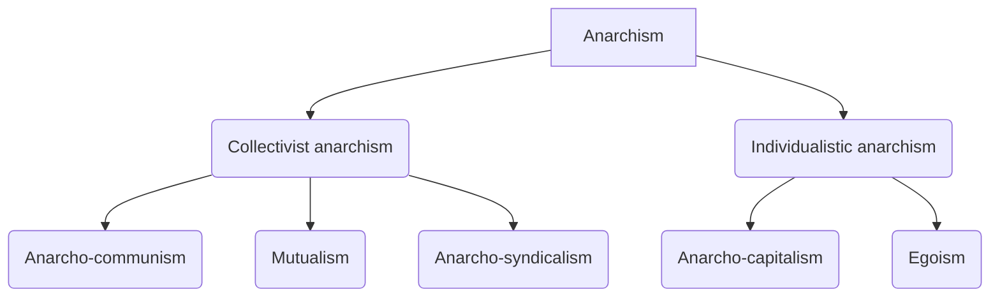

---
{"dg-publish":true,"permalink":"/02-politics/04-ideologies/anarchism/","tags":["homepage","anarchy"],"updated":"2026-02-23T13:30:37.058+00:00"}
---

## Notes
## Specification information
### Core ideas and principles

| Key terms     | Definition                                                                                                                                                                  |
| ------------- | --------------------------------------------------------------------------------------------------------------------------------------------------------------------------- |
| Power         | Power is the means or instruments (such as the law, the police, or the use of ideology) by which the state and other social institutions secure their authority.            |
| Authority     | Authority is the right of one person or institution to influence the behaviour of others and is seen as commanding, controlling, and corrupting.                            |
| Government    | Government is a particular system of rule — from monarchism to dictatorship to liberal democracy — based on deceit and violence.                                            |
| State         | The state is a sovereign body that exerts total authority over all individuals and groups living within it's defined geographical limits.                                   |
| Altruism      | Concern for the interest and welfare of others based on rational self-interest or a belief that humans are social beings with a capacity for social solidarity.             |
| Autonomy      | A form of self-government or legislation, a combination of freedom and responsibility, in which the individual is not subject to the will of the state or any other person. |
| Direct action | A whole range of political actions from non-violent to violent actions taken outside of the legal and constitutional framework.                                             |
1. **Rejection of the state** — the state is immoral as it rules by physical coercion and deceit, unjust in its defence of economic inequality and must be rejected due to its impact on human nature — to cover the arguments against the state, power and political participation and how the state can be overthrown.
2. **Liberty** — is incompatible with any form of political authority in the state, society, or the economy and is critical to human nature — to cover the differing views of liberty and human nature within anarchism.
3. **Anarchy is order** — to cover how social order occurs naturally and spontaneously, emerging from human nature, and is the key to the belief in a peaceful, stable, stateless society.
4. **Economic freedom** — the economy should be a space where free individuals can manage their own affairs without state ownership or regulation — to cover the different criticisms of existing economic systems and different ways economic freedom can be achieved.
5. **Utopian** — to cover the operation and benefits of an idealised society in order to develop a critique of existing society and the criticisms levelled against anarchism as unachievable and unrealistic.

### Branches

| Key term         | Definition                                                                                                                                                                           |
| ---------------- | ------------------------------------------------------------------------------------------------------------------------------------------------------------------------------------ |
| Syndicalism      | Revolutionary trade unionism that uses direct action and the mass strike as an expression of working-class power to inspire popular revolt.                                          |
| Direct democracy | Citizens making law and policy decisions in person rather than through elected representatives in a form of popular, self-government.                                                |
| Solidarity       | A relationship of sympathy, co-operation and harmony between people, which means that they have no need to be regulated by the state and any regulation makes solidarity impossible. |
| Mutualism        | A system of equitable exchange between self-governing producers, organised individually or in association and small-scale private property based on use or possession.               |

Collectivist anarchism — committed to common ownership to nurture rational, altruistic and cooperative human nature:
- anarcho-communism
- mutualism
- anarcho-syndicalism

Individualist anarchism — committed to freedom where rational, autonomous, competitive and self-interested individuals can make judgements in their own best interests:
- anarcho-capitalism
- egoism

### Thinkers

| Key term         | Definition                                                                                                                                                                                                             |
| ---------------- | ---------------------------------------------------------------------------------------------------------------------------------------------------------------------------------------------------------------------- |
| Collectivisation | The abolition of private property and its replacement by a system of common ownership.                                                                                                                                 |
| Mutual aid       | The most successful species are those that employ solidarity and co-operation rather than individualistic competition.                                                                                                 |
| Insurrection     | Is not synonymous with revolution but is rather egoistic, not a political or social act, that allows individuals to elevate themselves above the established institutions, leaving the establishment to decay and die. |

