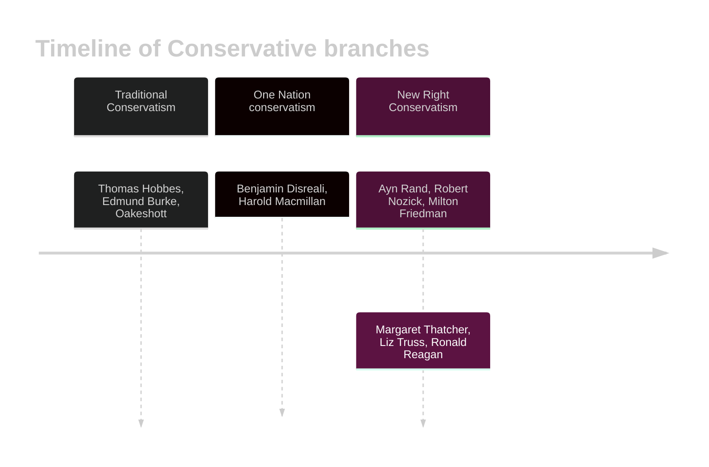

---
{"dg-publish":true,"permalink":"/02-politics/04-ideologies/conservatism/","tags":["homepage"],"updated":"2026-01-23T10:44:24.575+00:00"}
---

## Introduction

Conservatism is the least 'ideology' of ideologies. It isn't defined by universal principles like socialism and liberalism, rather by reactionary ideas. This means that it varies a lot when from different time periods.

The only principles they really have are peace, prosperity, and pragmatism. Do what works — if it ain't broke, don't fix it.

There are three branches covered in conservatism. 

### Principles

Yeah, I lied. But only a little! Conservatism does have some principles! But not really, this is British conservatism, specifically. You need to know them anyway, so....

| Principle                   | What does it mean?                                                                                                                                                                                                                                     | Why do they believe this?                                                                                                                                                                                    |
| --------------------------- | ------------------------------------------------------------------------------------------------------------------------------------------------------------------------------------------------------------------------------------------------------ | ------------------------------------------------------------------------------------------------------------------------------------------------------------------------------------------------------------ |
| **Pragmatism**                  | Be flexible in dealing with issues in society. If it ain't broke, don't fix it — but if it is broke, preserve order and stability.                                                                                                                     | Edmund Burke emphasized the dangers of mob rule, so said that change is necessary to avoid a complete overhaul.                                                                                              |
| **Tradition**                   | Customs and traditions provide stability and continuity, creating social cohesion and a collective identity.                                                                                                                                           | The institutions and practices of the past have been 'tested by time' — similar to a Darwinian 'survival of the fittest' idea.                                                                               |
| **Human imperfection**          | Humans are limited creatures — intellectually and psychologically. Politics is too complicated to fully understand, and simplifying it makes solutions to political issues imperfect and simple.                                                       | It's traced back to the Christian idea of 'Original Sin,' — crime is not a product of social disadvantage, but a consequence of human instincts.                                                             |
| **Organic society/ Organicism** | society is a living entity with all it's parts working together in harmony. Society is maintained by a delicate set of relationships — and if this is disturbed, society will be undermined. This means society has a natural hierarchy and authority. | This is because society has developed over time — like a tree, as said by Burke. So, the way that the state works should be to gently maintain that wisdom that has been built over generations.             |
| **Paternalism**                 | A higher authority knows best and acts in the best interests of all: the state, which acts as a wise and benevolent parent.                                                                                                                            | This is because those in authority 'know best', and so it is their duty to care for the lower social ranks. (Burke). This is strongly linked to their ideas of hierarchy and authority (natural, necessary). |
| **Libertarianism**              | **Only supported by the New Right.** Extend the most amound of freedom to the individual. The role of the state is that of minimal intervention, to only protect individual rights.                                                                    | They believe this because they believe that individuals prosper with minimal intervention. This explicitly contrasts with other conservative ideas.                                                          |
| **The economy and property**    | They support private property and the capitalist system. They believe that property must be safeguarded from disorder and lawlessness, because it promotes good things. (see ->)                                                                       | This is because property has a range of advantages: a sense of security, a source of protection, respect for the property of others.                                                                         |
