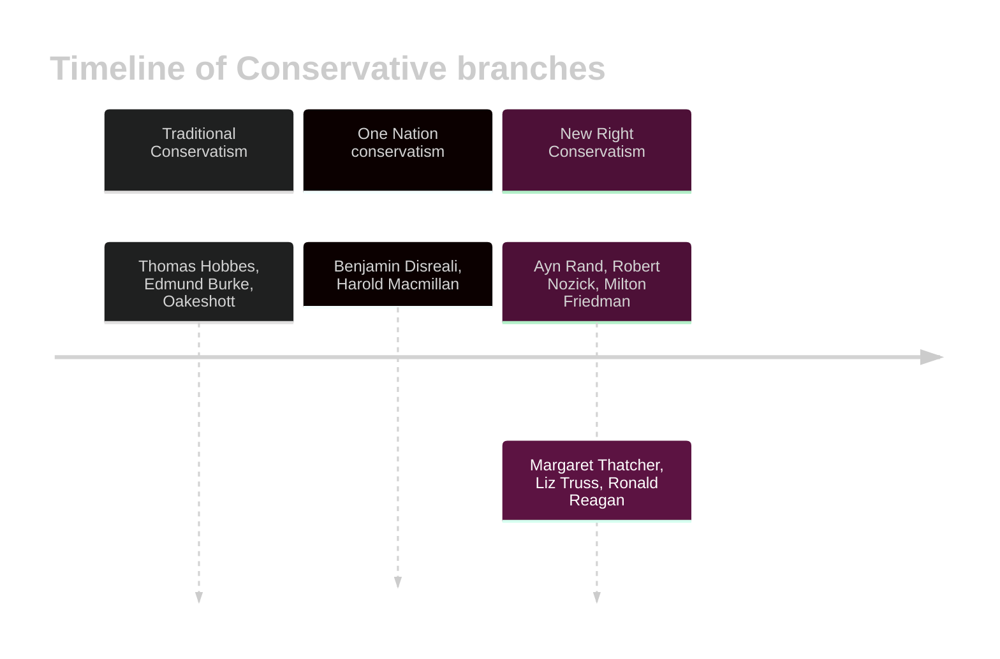

---
{"dg-publish":true,"permalink":"/02-politics/04-ideologies/conservatism/conservatism/","tags":["homepage","conservatism"],"noteIcon":"","updated":"2026-03-12T15:29:03.898+00:00"}
---

- [[02 - Politics/04 - Ideologies/Conservatism/How similar is one nation conservatism to traditional conservatism\|How similar is one nation conservatism to traditional conservatism]]
- [[02 - Politics/04 - Ideologies/Conservatism/The New Right\|The New Right]]

- [[02 - Politics/04 - Ideologies/Conservatism/How similar are conservatives about their principles.canvas\|How similar are conservatives about their principles.canvas]]
- [[02 - Politics/04 - Ideologies/Conservatism/Conservative principles\|Conservative principles]]
- [[02 - Politics/04 - Ideologies/Conservatism/Conservatism similarities and differences\|Conservatism similarities and differences]]

## Introduction

Conservatism is the least 'ideology' of ideologies. It isn't defined by universal principles like socialism and liberalism, rather by reactionary ideas. This means that it varies a lot when from different time periods.

The only principles they really have are peace, prosperity, and pragmatism. Do what works — if it ain't broke, don't fix it.

There are three branches covered in conservatism. 

### Principles

Yeah, I lied. But only a little! Conservatism does have some principles! But not really, this is British conservatism, specifically. You need to know them anyway, so....

| Principle                       | What does it mean?                                                                                                                                                                                                                                     | Why do they believe this?                                                                                                                                                                                    |
| ------------------------------- | ------------------------------------------------------------------------------------------------------------------------------------------------------------------------------------------------------------------------------------------------------ | ------------------------------------------------------------------------------------------------------------------------------------------------------------------------------------------------------------ |
| **Pragmatism**                  | Be flexible in dealing with issues in society. If it ain't broke, don't fix it — but if it is broke, preserve order and stability.                                                                                                                     | Edmund Burke emphasized the dangers of mob rule, so said that change is necessary to avoid a complete overhaul.                                                                                              |
| **Tradition**                   | Customs and traditions provide stability and continuity, creating social cohesion and a collective identity.                                                                                                                                           | The institutions and practices of the past have been 'tested by time' — similar to a Darwinian 'survival of the fittest' idea.                                                                               |
| **Human imperfection**          | Humans are limited creatures — morally, intellectually and psychologically. Politics is too complicated to fully understand, and simplifying it makes solutions to political issues imperfect and simple.                                              | It's traced back to the Christian idea of 'Original Sin,' — crime is not a product of social disadvantage, but a consequence of human instincts.                                                             |
| **Organic society/ Organicism** | society is a living entity with all it's parts working together in harmony. Society is maintained by a delicate set of relationships — and if this is disturbed, society will be undermined. This means society has a natural hierarchy and authority. | This is because society has developed over time — like a tree, as said by Burke. So, the way that the state works should be to gently maintain that wisdom that has been built over generations.             |
| **Paternalism**                 | A higher authority knows best and acts in the best interests of all: the state, which acts as a wise and benevolent parent.                                                                                                                            | This is because those in authority 'know best', and so it is their duty to care for the lower social ranks. (Burke). This is strongly linked to their ideas of hierarchy and authority (natural, necessary). |
| **Libertarianism**              | **Only supported by the New Right.** Extend the most amount of freedom to the individual. The role of the state is that of minimal intervention, to only protect individual rights.                                                                    | They believe this because they believe that individuals prosper with minimal intervention. This explicitly contrasts with other conservative ideas.                                                          |
| **The economy and property**    | They support private property and the capitalist system. They believe that property must be safeguarded from disorder and lawlessness, because it promotes good things. (see ->)                                                                       | This is because property has a range of advantages: a sense of security, a source of protection, respect for the property of others.                                                                         |

<a class="markdown-embed-link" href="/02-politics/04-ideologies/conservatism/conservatism-similarities-and-differences/" aria-label="Open link"><svg xmlns="http://www.w3.org/2000/svg" width="24" height="24" viewBox="0 0 24 24" fill="none" stroke="currentColor" stroke-width="2" stroke-linecap="round" stroke-linejoin="round" class="svg-icon lucide-link"><path d="M10 13a5 5 0 0 0 7.54.54l3-3a5 5 0 0 0-7.07-7.07l-1.72 1.71"></path><path d="M14 11a5 5 0 0 0-7.54-.54l-3 3a5 5 0 0 0 7.07 7.07l1.71-1.71"></path></svg></a>

|              | Traditional conservatives                                                                                                                                                                                                                         | One nation conservatism                                                                                                                                                                                                                                                           | The New Right                                                                                                                                                                                                                                                                                                                                                                           |
| ------------ | ------------------------------------------------------------------------------------------------------------------------------------------------------------------------------------------------------------------------------------------------- | --------------------------------------------------------------------------------------------------------------------------------------------------------------------------------------------------------------------------------------------------------------------------------- | --------------------------------------------------------------------------------------------------------------------------------------------------------------------------------------------------------------------------------------------------------------------------------------------------------------------------------------------------------------------------------------- |
| State        | Values institutions that have stood the test of time. The state knows what is best because of hierarchy inherent to society, so people should obey the state — because it is Hard Paternalistic.  Any change should be small and pragmatic. | Values institutions that have stood the test of time, but the institutions aren't currently standing the test of time, encouraging division in society.   The state has an obligation to look after people who are unable to look after themselves — i.e. Soft Paternalism. | Reject tradition and organicism — the state's duty is to support individualism and freedom economically, and the best way to do this is with as little economic intervention as possible.  However, the state should be authoritative in terms of morals.                                                                                                                         |
| Society      | Society is more important than individuals. Everyone should accept their place in a hierarchic society because it is organic, and authority comes from above.                                                                                     | Society is more important than individuals, and society is naturally hierarchic because organicism — so authority should be accepted because it is what is best.   Rich (higher in the hierarchy) should take care of the poor because it's their duty.                     | The individual is more important than society, are atomistic, and individualistic — but they are picking and choosing when to be individualistic. However, you must do your duty to your family and your nation.  Hierarchy still exists, but it's based on making money and not pre-existing social class which shouldn't change a lot.                                          |
| Economy      | If it ain't broke, don't fix it. (Free-market)                                                                                                                                                                                                    | If it ain't broke, don't fix it. But, it is broke, so fix it. (Any type, but specifically mixed, because free market has created a shitton of poverty..)                                                                                                                          | FUCK ALL YALL. (very free market. Needs to be free because otherwise it becomes authoritarian — it's a moral argument.)  Neo-conservatives want low taxes because high taxes creates a dependency culture, and if you worked hard, you should get to keep your money. Hard work is a Victorian value. Neo-liberals want free market because its your fucking money. Tax is theft. |
| Human nature | Humans are intellectually, morally, and psychologically imperfect. This means that we cannot fully understand everything that is going on, and so shouldn't change something unless it's broken.                                                  | Humans are intellectually, morally, and psychologically imperfect. This means we cannot fully understand everything that is going on.                                                                                                                                             | Humans are rational, hence they believe in individualism, and reject organicism. However, you still need to do your duty to family and state and not be a gay whore. We are rational, but subject to temptation.                                                                                                                                                                        |

