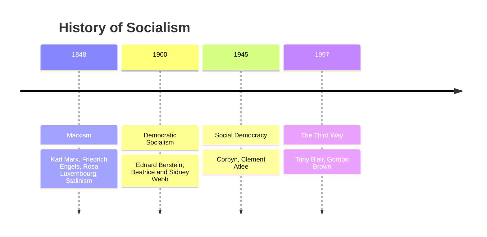

---
{"dg-publish":true,"permalink":"/02-politics/04-ideologies/social-democracy/","tags":["lessonminor"],"updated":"2025-11-28T13:35:43.044+00:00"}
---

## What is Democratic Socialism?
- entirely planned economy
- sweeping changes to society
### Was capitalism changing?
- Marx predicted that over time, wealth would concentrate into the hands of a smaller and smaller bourgeoisie.
	- However, this guy called Eduard Bernstein argued that this wasn't happening
- By the 1980s, Bernstein argued that capitalism was spreading wealth, not concentrating it. 
>[!TIP]
>Marxists are the **only** socialists that believe that communism will occur/ we will all eventually live in communes

## Where does Social Democracy emerge from?

It majorly starts in the 1930s as there are a lot of economic problems:
1. hunger
2. wall street crash
3. absolute poverty en masse
4. **Unemployment** (in part caused by the wall street crash)
5. war debt
6. illness — poor public health because: people can't get treated 🡺 their disease spreads 🡺 more people have the disease and can't get treated 🡺 vicious cycle.

### How does the Labour government try to change this?

1. nationalising businesses
2. setting up the welfare state and the NHS
3. tax the rich heavily to put it into nationalized companies