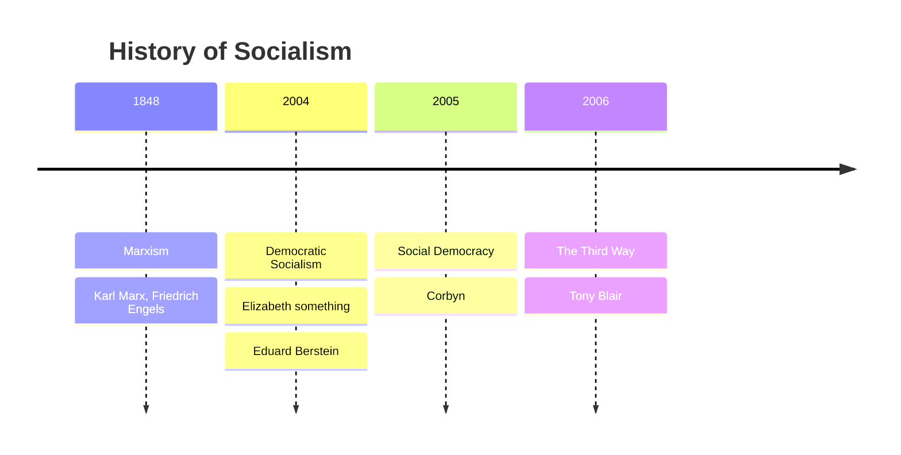

---
{"dg-publish":true,"permalink":"/politics/03-ideologies/social-democracy/","tags":["lessonminor"],"updated":"2025-11-27T15:39:47.189+00:00"}
---

## Where does Social Democracy emerge from?

It majorly starts in the 1930s as there are a lot of economic problems:
1. hunger
2. wall street crash
3. absolute poverty en masse
4. **Unemployment** (in part caused by the wall street crash)
5. war debt
6. illness — poor public health because: people can't get treated 🡺 their disease spreads 🡺 more people have the disease and can't get treated 🡺 vicious cycle.

### How does the Labour government try to change this?

1. nationalising businesses
2. setting up the welfare state and the NHS
3. tax the rich heavily to put it into nationalized companies